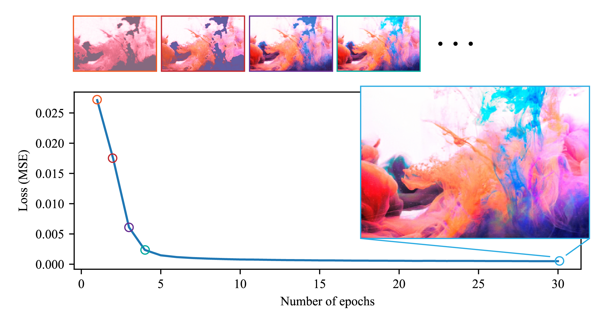

# Hash-based Neural Fields Written in C++/Eigen



## TL;DR
This is an implementation of the [hash-based positional encoding](https://nvlabs.github.io/instant-ngp/) for [neural fields](https://neuralfields.cs.brown.edu/) written in C++/Eigen.
This repository also contains a minimalistic C++ code for neural network training using gradient back-propagation.
I wrote this code to understand what's going on at a low level with a minimal dependency. I'd be happy if this repository works as a good reference for somebody interested in neural fields and neural network training.

Note: currently, only 2D neural fields are supported.

## Dependencies
- C++20/Eigen
- Python 3.8
- Numpy
- Pillow

## Installation
Clone this repository recursively. The Python interface of the C++ code uses [Nanobind](https://github.com/wjakob/nanobind), which will be installed under ```eigen-nn/ext/```
```
git clone --recursive git@github.com:kenji-tojo/eigen-nn.git
```

## Running
You can use ```cmake``` to build. For example, the following command
```
eigen-nn$ mkdir build && cd build
eigen-nn/build$ cmake .. -DCMAKE_BUILD_TYPE=Release
eigen-nn/build$ make -j9
```
will create a nanobind module under ```eigen-nn/```.

Then, you can run
```
eigen-nn$ python train.py input/fluid.png --enc hash
```
to fit a 2D neural field to the input image.

The code also implements the [Fourier feature](https://bmild.github.io/fourfeat/) input encoding. You can switch between and compare different encoding schemes using the ```--enc``` option:
```
eigen-nn$ python train.py input/fluid.png --enc fourier
eigen-nn$ python train.py input/fluid.png --enc none
```